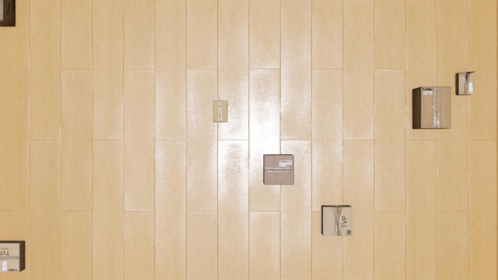

<h1 align="center">Metron AI - Artificial Data Generator (ArDaGen)</h1>

<p align="center">
  <kbd></kbd>
</p>

Metron AI ArDaGen is a synthetic data generator build on
[NVIDIA Omniverse](https://developer.nvidia.com/nvidia-omniverse-platform) platform to generate physically accurate
images and annotations to train Metron AI.

<p align="center">
    <a href="https://ondrejszekely.github.io/metron_ai_ardagen"><strong>Explore Metron AI ArDaGen docs »</strong></a>
</p>

## Key Features

:boom: photorealistic physical based rendering via NVIDIA Omniverse
:boom: vast image content variations
:boom: 100% accurate annotations
:boom: uses SOTA configuration framework - Meta's Hydra
:boom: modular architecture with custom design scenarios

## Table of Content

[1. Project Installation](/docs/project_installation.md)\
[2. Architecture](/docs/architecture.md)\
[3. Configuration](/docs/configuration.md)\
[4. Synthesizer Workers](/docs/synthesizer_workers.md)\
[5. Scenarios](/docs/scenarios.md)\
[6. Development Notes (Metron project link)](https://github.com/OndrejSzekely/metron/blob/main/docs/development_notes.md)

## How to run

After you install the solution, go into *Isaac Sim* root folder in a terminal and run

```shell
./python.sh metron_ai_ardagen/metron_ai_ardagen_run.py
```

It loads ArDaGen's configuration via *Hydra* framework. See [configuration](/docs/configuration.md) for mode details.
