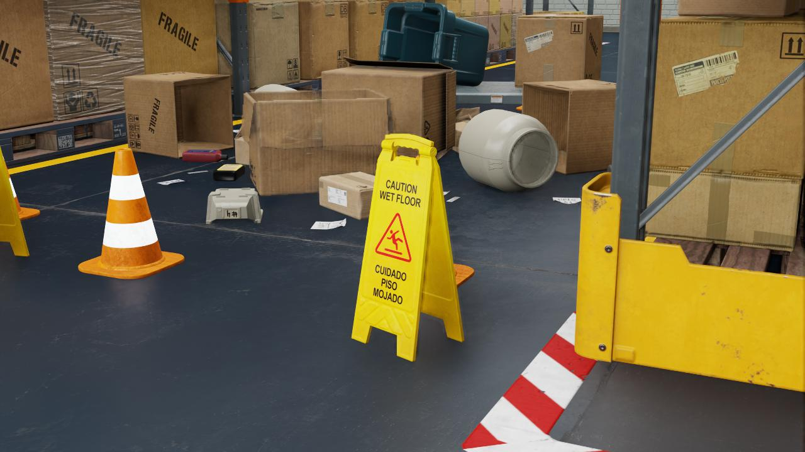

# Metron AI - Artificial Data Generator (ArDaGen)

Metron AI ArDaGen is a synthetic data generator build on
[NVIDIA Omniverse](https://developer.nvidia.com/nvidia-omniverse-platform) platform to generate physically accurate
images and annotations to train Metron AI.

## Key Features

:boom: photorealistic physical based rendering via NVIDIA Omniverse
:boom: vast image content variations
:boom: 100% accurate annotations
:boom: Uses SOTA configuration framework - Meta's Hydra
:boom: Modular architecture with custom design scenarios

## Table of Content

[1. Project Installation](/docs/project_installation.md)\
[2. Architecture](/docs/architecture.md)\
[3. Development Notes (Metron project link)](https://github.com/OndrejSzekely/metron/blob/main/docs/development_notes.md)
