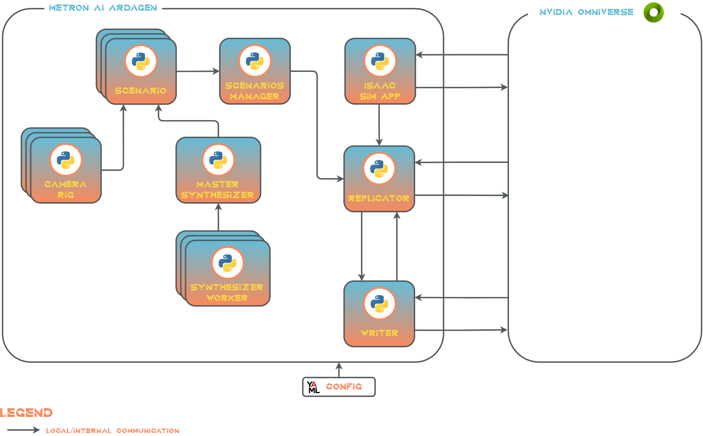

# High Level Architecture

## Architectural Decisions

Metron AI ArDaGen is based on *NVIDIA Omniverse* which performs all the work. ArDaGen is just a wrapper which defines
a configuration of [Omniverse Isaac Sim Replicator](https://developer.nvidia.com/blog/closing-the-sim2real-gap-with-nvidia-isaac-sim-and-nvidia-isaac-replicator/). On top of that it uses Meta's Hydra
configuration framework and reuses primitives from Metron Shared. Module and packages design adress easy and flexible
configuration and follow high code standards.

## Architectural Description

The architecture is based on *Linux OS*, specifically *Ubuntu* running on *NVIDIA GPU* powered machine.

The solution is consisted only of one component which is consisted of eight modules.

### Isaac Sim App

It is a wrapper around *Isaac Sim* app from *Omniverse* platform. It provides basic app handle operations, such as
application initialization and destruction.

### Camera Rig

Camera Rig defines camera setup, which could be in the simplest case just one camera. More complex cases might be stereo
camera setup or 360 degree view. It defines also camera type, e.g. pinhole or fisheye with camera intrinsic parameters.

### Synthesizer Worker

It represents a 3D scene layer handler which contributes to the complete scene. For instance, it might represent a
ground plane handler, lighting handler, foreground 3D objects handler for annotations generation, etc. It provides
also a randomization of the contributed layer assets, so each generated artificial data record has a different
placement of assets, materials, parameters, etc. See [existing synthesizer workers overview](../scenarios.md)
for more details.

### Master Synthesizer

It manages multiple layer scenes, which create a whole scene, defined by a series of Synthesizer Workers.

### Scenario

Scenario represents a scenario, which means a scene with all assets, lighting, physics, etc. and camera rigs. It means
that one scenario has one Master Synthesizer with various Synthesizer Workers and one or more Camera Rigs to record
data with various optics and setup. See [existing scenarios overview](../scenarios.md) for more details.

### Scenarios Manager

In one run there can be multiple scenarios defines by Scenario, therefore Scenarios Manager orchestrates the execution
of all Scenarios.

### Writer

It is a writer of generated artificial data. Basically it is a wrapper of *Omniverse Isaac Sim Replicator* writer. It
saves data on the filesystem.

### Replicator

It is a handler of *Omniverse Isaac Sim Replicator*. It does the orchestration of execution of scenarios defines by
Scenarios Manager inside sice *Omniverse Isaac Sim Replicator*. Generated data is saved via Writer.
