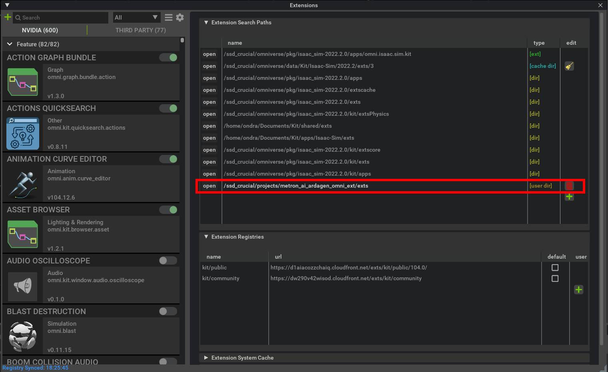

# Project Installation

Solution is based on [NVIDIA Omniverse](https://developer.nvidia.com/nvidia-omniverse-platform) with Python interface.
There are two ways of installation. End user installation and development installation. *The guide follows Linux based
installation steps*, which is also the recommended option.

## End User Installation

### Docker Compose

:::{error}
*Docker Compose* guide is not complete!
:::

::::{admonition} Attention
:class: warning

```{eval-rst}
|:exclamation:| NVIDIA GPU is required. |:exclamation:|
```
::::

To be able to run ArDaGen using Docker Compose, perform following steps:

1. Install Docker ([how to install](https://docs.docker.com/get-docker/)).
2. Install Docker Compose ([how to install](https://docs.docker.com/compose/install/)).
3. Pull [NVIDIA Omniverse Isaac Sim Docker image](https://catalog.ngc.nvidia.com/orgs/nvidia/containers/isaac-sim).


## Development Installation

Follow the instruction steps.
**Linux (Ubuntu 22.04) installation was tested only. The installation might not work on Windows.**

::::{admonition} Attention
:class: warning

```{eval-rst}
|:exclamation:| NVIDIA GPU is required. |:exclamation:|
```
::::

1. Download and install NVIDIA Omniverse Launcher from [here](https://developer.nvidia.com/nvidia-omniverse-platform).

2. Run Omniverse Launcher and install Isaac Sim application.
[See the link.](https://docs.omniverse.nvidia.com/app_isaacsim/app_isaacsim/install_basic.html)

3. Install [Microsoft Visual Studio Code](https://code.visualstudio.com/).
**Other IDEs are not supported out of the box, nor tested.**

4. Download the repository using
    ```shell
    git clone --recurse-submodules https://github.com/OndrejSzekely/metron_ai_ardagen.git
    ```

5. Move ArDaGen repository into Isaac Sim's root folder.

    ```shell
    # a sample command, your paths will be different and also Isaac Sim version might not match
    mv  /ssd_crucial/projects/metron_ai_ardagen /ssd_crucial/omniverse/isaac_sim-2022.1.0/
    ```
6. Install *pre-commit* in your environment and then install the hook by running `pre-commit install`.

    ::::{admonition} Reference Installation Steps
    :class: tip, dropdown

    Perform steps **1** and **2** in [*Manual Documentation Building* section](./guides/docs_generation.md#manual-documentation-building).

    In the activated `dev_37` environment run following command:
    ```shell
    conda install -c conda-forge pre_commit
    ```
    and install *pre-commit* in the repo root folder:
    ```shell
    pre-commit install
    ```
    Detach the environment and add following lines
    ```sh
    source <ANACONDA_ROOT_PATH>/etc/profile.d/conda.sh
    conda activate dev_37
    ```
    right after `# start templated` comment line in the file `.git/hooks/pre-commit`. Replace `<ANACONDA_ROOT_PATH>` with your *Anaconda* install dir.
    ::::

7. *(optional)* Download [Shapenet's](https://shapenet.org/) ShapeNetCore v2 dataset.
You have to register on the page to be allowed to download the dataset. Place the
downloaded dataset into any arbitraty location, but a fast storage is recommended.

1. To start Visual Studio project, go into Isaac Sim's root folder and run `code .`. It will open a setup Visual
Studio project with everything predefined.

    In the *Explorer* tab whole Isaac Sim folder is present, but everything else, except *metron_ai_garden* folder,
    is irrelevant for the development.

    ::::{hint}

    ```{eval-rst}
    |:clipboard:| |:raised_hand:| Be aware that debuging is performed using the *Python: Current File* option in *Run & Debug*.
    ```
    ::::

1. Append

    ```yaml
    "./metron_ai_ardagen",
    ```

    into `python.analysis.extraPaths` list in
    `<ISAAC_SIM_ROOT_FOLDER_PATH>/.vscode/settings.json` file.

2.  Install missing Python requirements. Go into Isaac Sim's root folder and run
`./python.sh -m pip install -r metron_ai_ardagen/requirements.txt`.

1.  Download *Metron AI ArDaGen Omniverse Extension* which is an *Omniverse* Extension
    ```
    git clone --recurse-submodules https://github.com/OndrejSzekely/metron_ai_ardagen_omni_ext.git
    ```

2.  Run *Isaac Sim* and open Extension window (*window* ⟶ *Extensions*). Click on the *gear icon*
    and in *Extension Seatch Paths* add the path to `exts` folder in the cloned
    *Metron AI ArDaGen Omniverse Extension* repository.

    

## Bug Fixes

#### Bug #1: OV Replicator camera detach fails at the end of data generation

```shell
'dict' object has no attribute 'discard'
  File "/ssd_crucial/omniverse/library/isaac_sim-2022.1.0/exts/omni.replicator.core-1.2.0+cp37/omni/replicator/core/scripts/writer_registry.py", line <line_num>, in detach
```

In `exts/omni.replicator.core<VERSION>/omni/replicator/core/scripts/writer_registry.py` on line **<line_num>** change

```python
cls._render_product_writer_mapping[render_product].discard(writer_name)
```

into

```python
cls._render_product_writer_mapping[render_product].pop(writer_name)
```