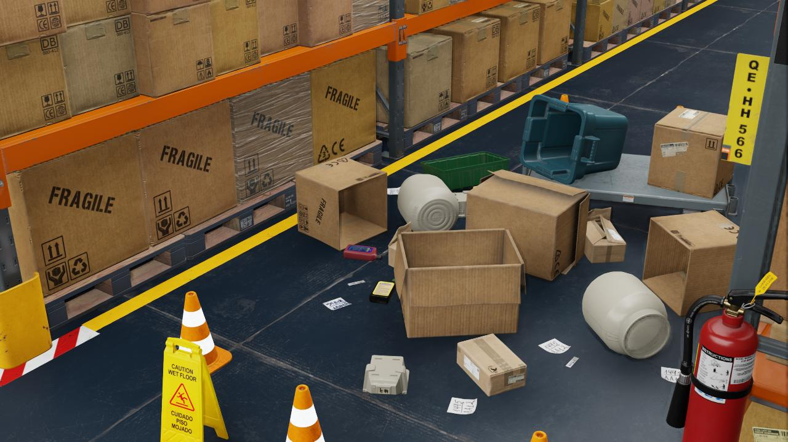
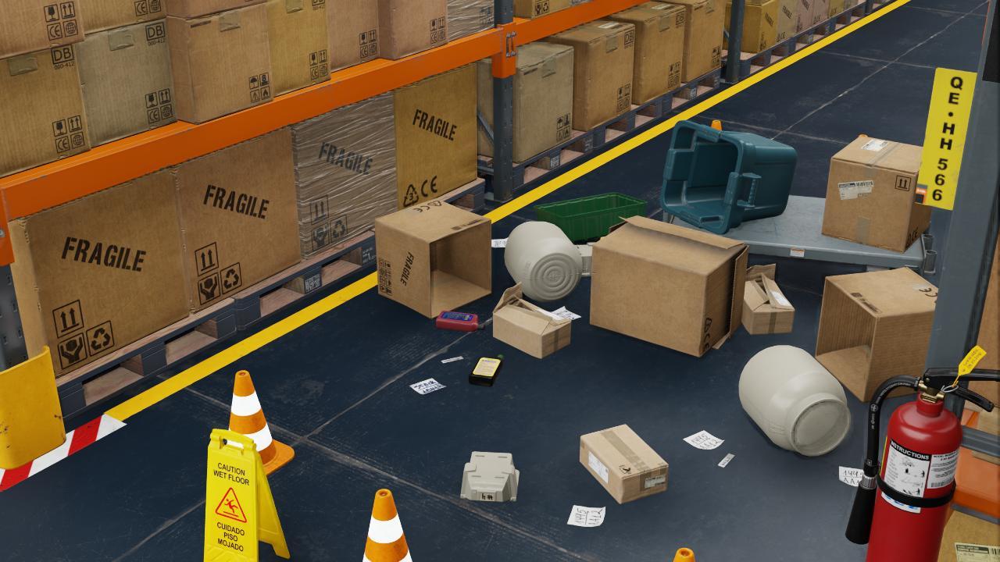

# Scenarios

This section shows an overview of implemented scenarios with their description.

## Dummy Scenario

This scenario, as its name suggests, is very basic and it's used as a check that all works fine after code changes of
the ArDaGen's modules. It uses *Isaac Sim's* `full_warehouse` USD scene with still single camera. It depict a scene
fraction with focus on items spred on the ground. There is one randomization element which hides the closest box on the
ground time to time. It produces tight bounding box annotations.

